# 知识书架 · vibe-shelf

**把你的项目，读成一本书。放进源码，写一句你最想读懂什么，它就写出一本有章节、有目录、有自己书皮的项目书。**

知识书架把一个项目的源码变成一部可以继续生长的本地项目书。读到哪里没懂，就在页边划词提问；想核对，点一下就回到源码原文；想往书外走，就在书底继续探索，值得留下的回答还能长成一本新的小书。书里的讲解、旁注和探索都只从你的源码里取材，找不到就照实说。

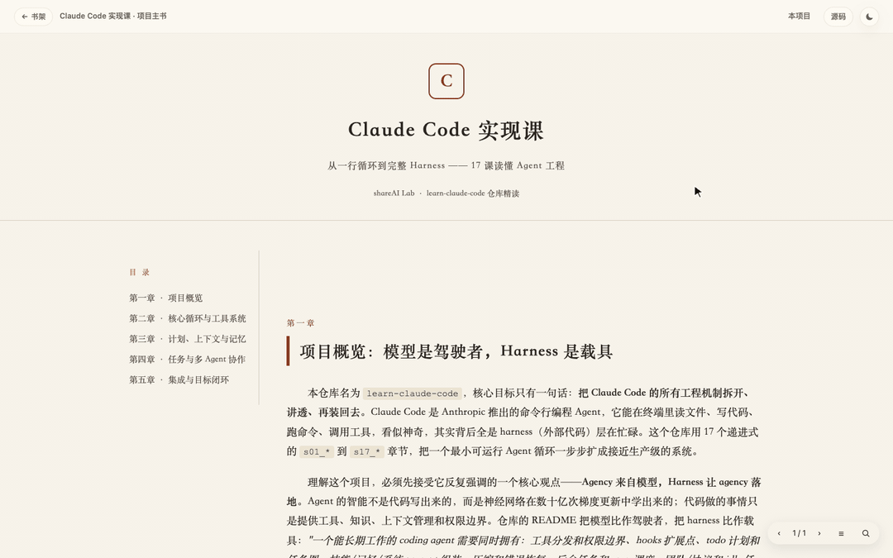

<sub>动图里的书是「Claude Code 实现课」；页边的回答是这本书之前真实生成过的一条旁注，录制时直接复用，省掉等模型的几秒。</sub>

> **在线演示**：<https://dontttbefly-sketch.github.io/vibe-shelf/>，可以翻书、划词，旁注存在你的浏览器里；写书和 AI 回答需要[在本地运行](#快速开始)。
>
> 常开版部署在 <https://shelf.kongbei.xyz>，目前是邀请制。想试用的话，欢迎发邮件到 [15916363770@163.com](mailto:15916363770@163.com) 联系我。

## 五件事，围着同一本书

| 功能 | 做什么 |
|---|---|
| **写书** | 放进本地文件夹或 GitHub 仓库，写一句侧重点，几分钟后得到一本项目主书 |
| **书架** | 所有项目书放在一起：接着上次读、搜索、不翻开就预览目录 |
| **旁注** | 划词提问，回答写在页边；还能就地追问改写，改了哪里一眼看得出 |
| **源码** | 书里提到的文件一点就开，正文和源码互相跳转 |
| **探索** | 在书底问书里没讲的方向，值得留下的回答长成一本探索小书 |

### 写书：放进项目，写一句你想读懂什么


- 首页点「把我的项目变成书」，一本书飞到书桌中央翻开：左页填写，右页是这本书的扉页
- **放进项目**：选择或拖入本地文件夹，也可以填公开的 GitHub 仓库（`owner/name` 或完整地址）
- **写下侧重点**：一两句话说出你最想读懂什么，比如「请求怎样走到数据库」「我要接手，哪里改动风险最大」；不填就先讲清全貌
- **右页实时排版**：项目名成为书名，侧重点成为副标题；目录里的每一步真正完成了才打勾

<p align="center">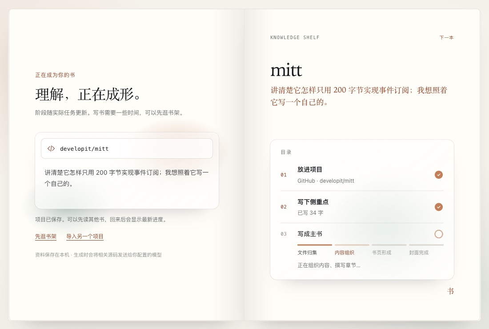</p>

- 生成分四段：文件归集、内容组织、书页形成、封面完成。写一本书要几分钟，这期间可以先去逛书架，顶栏会一直提示进度；万一中断了，项目和侧重点都还在，直接重试
- 第一章交代项目全貌，后面的篇幅优先留给你写的侧重点
- 每本书都有自己的书皮：配色、字体和装饰从项目内容里取意象，而且不会和书架上已有的书撞色

<table>
  <tr>
    <td width="33%">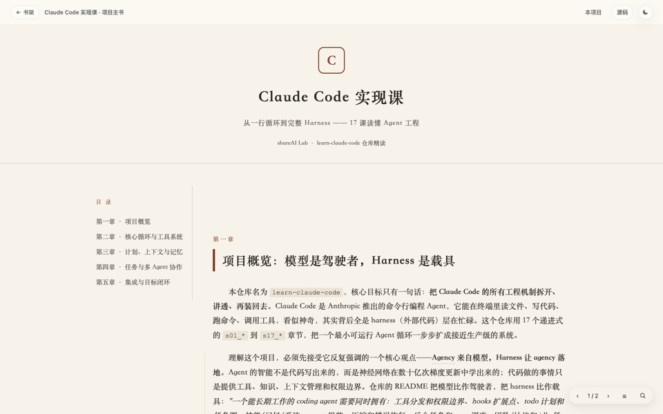</td>
    <td width="33%">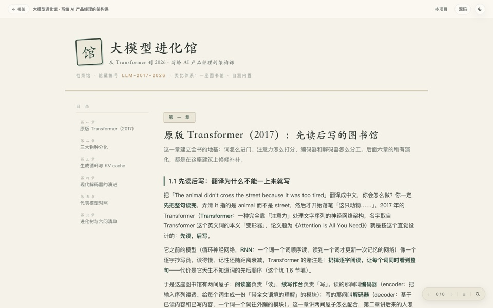</td>
    <td width="33%">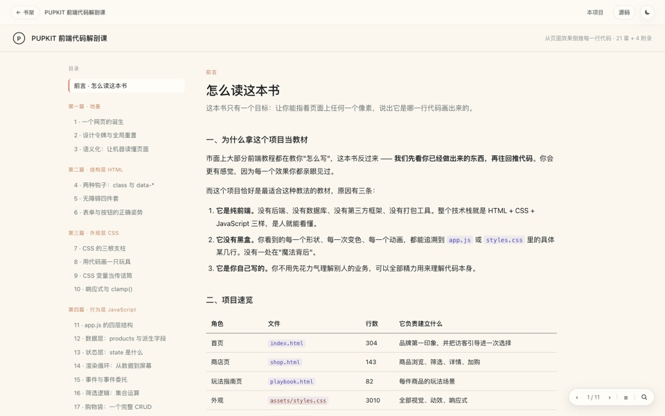</td>
  </tr>
  <tr>
    <td align="center">Claude Code 实现课</td>
    <td align="center">大模型进化馆</td>
    <td align="center">PUPKIT 前端代码解剖课</td>
  </tr>
</table>

### 书架：上次读到哪，一眼就能接上

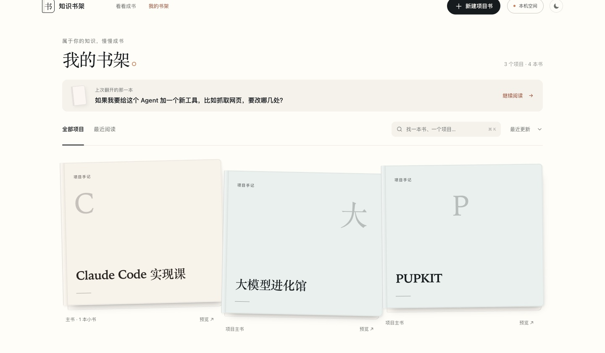

- 上次读的那一本单独列出来，点「继续阅读」回到读到的位置
- 可以搜索（`⌘K`）、排序，也可以只看最近读过的
- 点「预览」，不用翻开就能看到简介和目录，用 `←` `→` 切换上一本、下一本

<p align="center"></p>

### 旁注：哪里没懂，就在哪里问

- 选中正文里没看懂的地方，选区下方出现「＋ 补注释」，点它或按回车，写下你的问题（就是最上面那段动图）
- 回答写在页边，AI 结合项目源码来解释；正文里那句话会留下一道记号，以后点它就能回看
- 选中的是一段代码时，对应的源码文件会自动勾上，一起交给 AI 参考

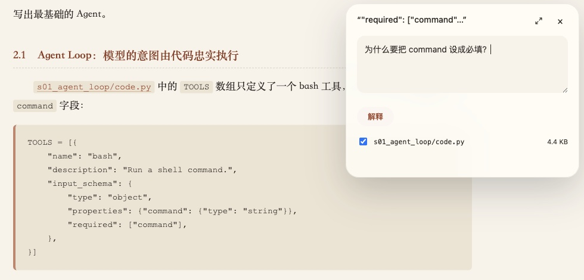

- **追问直接改在旁注里**：在旁注里再选中一段，点「追问这段」，说你想怎么改，比如「换个更有画面感的说法」。改完写回旁注：删掉的字带删除线，新加的字带底色；每次追问都在下方留一行「↳ 你问：……」，就是这条旁注的修改记录

<table>
  <tr>
    <td width="50%">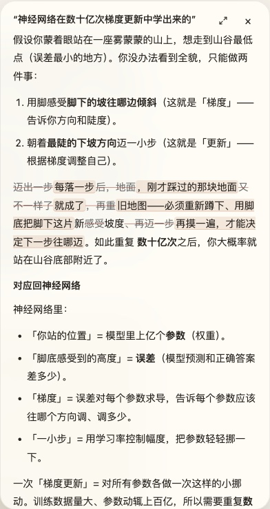</td>
    <td width="50%">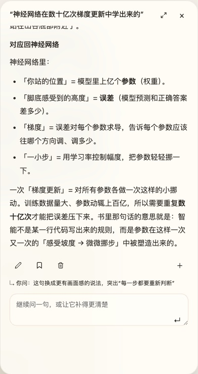</td>
  </tr>
  <tr>
    <td align="center">改动就地标出：删去的划掉，新加的高亮</td>
    <td align="center">每次追问留一行记录，可以接着问</td>
  </tr>
</table>

- 旁注可以编辑、删除，或者「添加为正文」并进书里；右下角的 ‹ › 在整本书的旁注之间跳转，☰ 列出全部旁注
- **问这本书**（右下角的放大镜）：对整本书提问，它会告诉你书里有没有写到、写在哪里，可以直接跳过去，也可以把回答插进书里变成一张补充卡
- 断网或同时开了几个窗口也不会丢稿：草稿先存在本机，恢复连接后自动同步

### 源码：讲到哪个文件，就能打开哪个文件

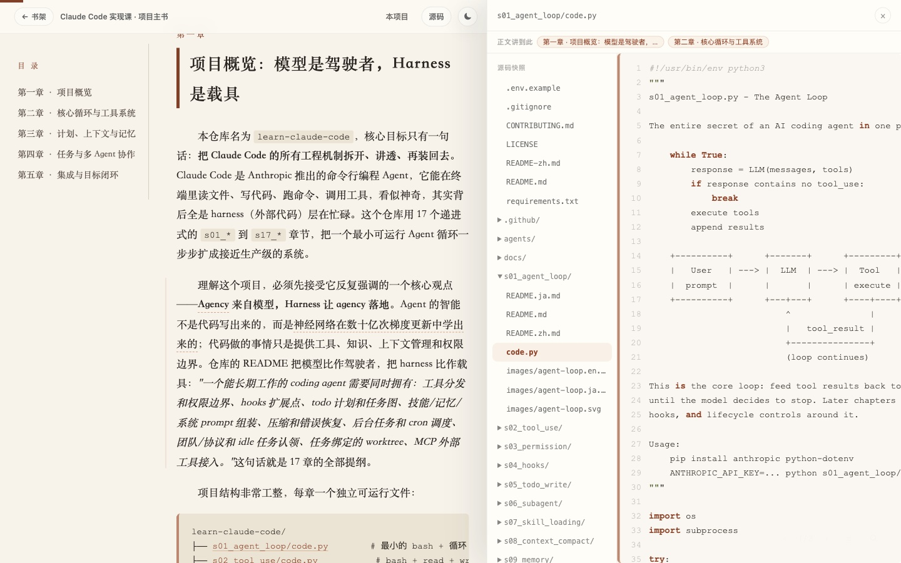

- 点顶栏的「源码」，或者书里任何一个文件路径，右侧打开源码面板：左边是导入时那份源码快照的文件树，右边是带行号的原文
- 顶部的「正文讲到此」列出书里哪些章节讲到了这个文件，点一下就跳回正文
- 书里的代码片段会自动对应到源码中的真实位置；只有能确定是哪一个文件时，路径才会变成链接，宁可不链也不链错
- 在源码面板里选中代码，同样可以加旁注；加过旁注的行号会被标出来

### 探索：书里没讲的，在书底接着问

<table>
  <tr>
    <td width="66%">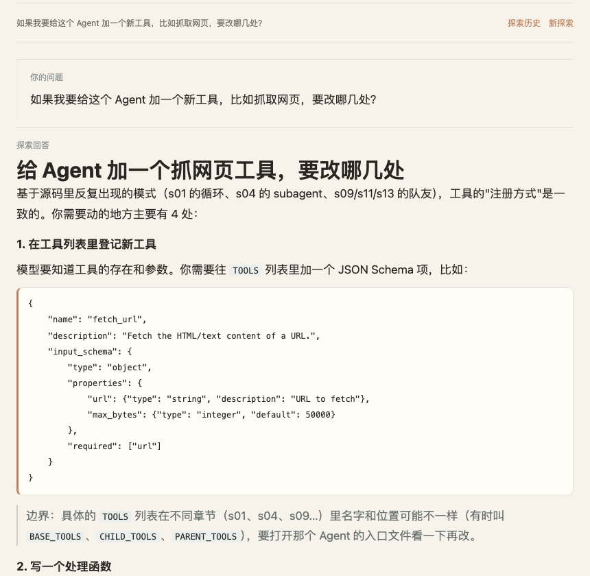</td>
    <td width="34%">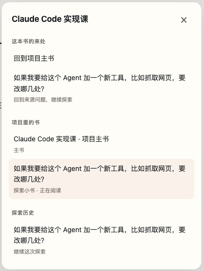</td>
  </tr>
  <tr>
    <td align="center">在书底提出新问题，回答结合源码</td>
    <td align="center">「本项目」：主书、小书和探索历史</td>
  </tr>
</table>

- 每本书的末尾都有「继续探索」，用来问书里没讲到的方向，比如「如果我要给这个 Agent 加一个新工具，要改哪几处？」。回答结合项目源码，并列出参考了哪些文件
- 可以接着追问，问过的问题都留在探索历史里
- 觉得某次回答值得留下，就点「让这个问题长成一本书」，它会变成这个项目里的一本**探索小书**，同样可以划词旁注、继续探索；顶栏的「本项目」里能看到项目里所有的书和探索

## AI 只依据你的源码

- 每个项目导入时都存一份不可变的源码快照，书、旁注和探索都只从这份快照里取材
- 源码里找不到的内容，书里会照实写明，不编造
- 回答默认只是一条记录，不会自动变成书；只有你点了，它才留下来
- 所有读书工具都叠在书页上面，不改动原书的正文

## 其他细节

<table>
  <tr>
    <td width="50%"></td>
    <td width="50%">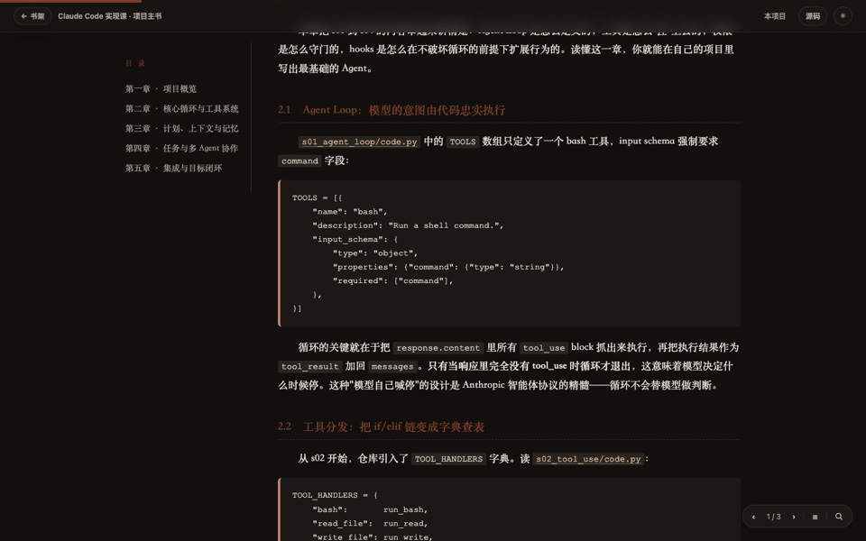</td>
  </tr>
</table>

- 右上角一键切换夜间模式，首页和整本书一起变暗
- 手机上也能读书、看旁注
- 设置里可以检查模型连接是否正常；一键备份全部资料（项目、源码快照、书、旁注和探索），也能从备份文件恢复；可以按项目导出，不常用的项目可以从书架收起，之后随时放回

<p align="center">
  
  &nbsp;
  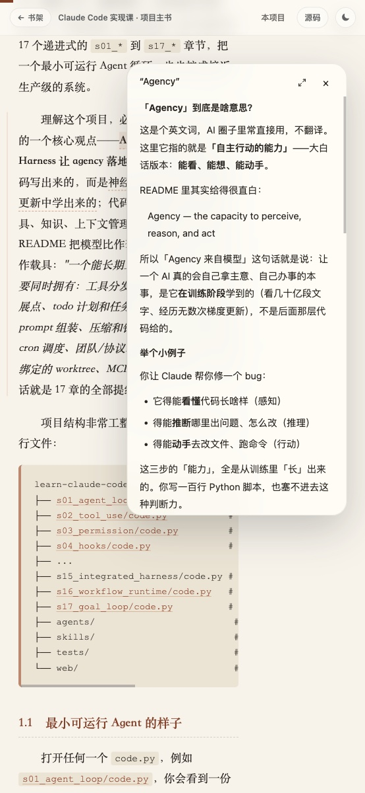
  &nbsp;
  
</p>

## 快速开始

需要 Node.js 18 或更高版本，没有任何 npm 依赖，clone 下来就能运行。

```bash
git clone https://github.com/dontttbefly-sketch/vibe-shelf.git
cd vibe-shelf
cp .env.example .env
node scripts/migrate-pupkit.mjs   # 放进内置的 PUPKIT 示例书
node server.mjs                   # 打开 http://localhost:8899
```

macOS 上也可以直接双击 [`启动知识书架.command`](启动知识书架.command)。

阅读、本地旁注和逛书架不需要配置。要写书和用 AI，在 `.env` 里填上模型的三项：

```
SHELF_API_URL=https://api.openai.com/v1/chat/completions
SHELF_API_KEY=你的密钥
SHELF_MODEL=gpt-4o-mini
```

任何 OpenAI 兼容接口都可以，比如 OpenAI、DeepSeek、MiniMax、Kimi 或本地的 Ollama。换成 128K 上下文的模型时，把 `SHELF_PROMPT_BUDGET_BYTES` 调到 `300000` 左右，否则写书的请求会因为太长被拒；其他可选项见 [`.env.example`](.env.example)。密钥只在本机服务里使用，不会进入网页。

## 想改什么

| 想做的事 | 改哪里 |
|---|---|
| 调整主书的写法、篇幅和书皮规则 | `lib/prompts.mjs` |
| 书怎样编译成网页、代码片段怎样对上源码 | `lib/book-compiler.mjs`、`lib/source-link.mjs` |
| 阅读器：旁注、追问、源码面板、问这本书 | `public/notes.js`、`public/notes.css` |
| 书底探索 | `public/explore.js`、`public/explore.css` |
| 首页、上传页和翻书转场 | `public/landing.js`、`public/upload-motion.js`、`public/upload-workspace.css` |
| 书架 | `public/shelf.js`、`public/shelf.css` |

## 架构与部署

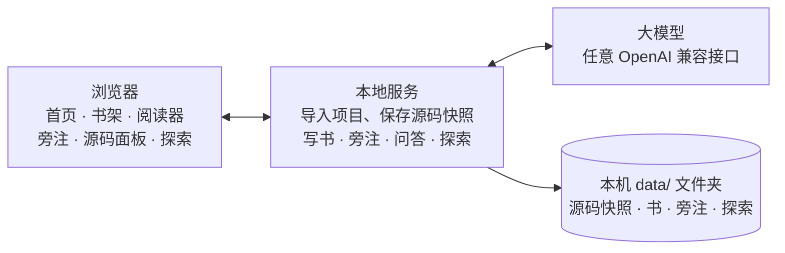

- **前端**：原生 HTML、CSS、JavaScript，不用前端框架，也没有打包步骤
- **后端**：只用 Node.js 内置模块写的服务
- **数据**：都是本机 `data/` 文件夹里的普通文件，备份就是拷贝文件

项目是后台空间，主书是用户进入项目后的界面：在书架上点开一个项目，就直接进入它的主书；源码快照、旁注、探索和小书都归在这个项目下面。阅读器是叠在书页上面的一层，所以每本书的书皮可以完全不同，用的却是同一套阅读器。

- **在线演示**：push 到 `main` 后先跑 `npm test`，通过后把 `public/` 发布到 GitHub Pages（`.github/workflows/pages.yml`）。演示版没有服务端，写书和 AI 的入口会提示去本地运行
- **公开服务模式**（`SHELF_MODE=public`）：访客用 GitHub 登录，每人一个独立书架，有每月写书和每天调用 AI 的额度，也可以只放行受邀的账号。部署到自己服务器的方法见 [deploy/README.md](deploy/README.md)
