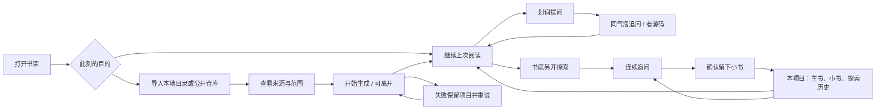

# 知识书架 · 体验方案与观察

日期：2026-09-28。用户已在目标文件中授权按体验主线实施；沿用已确认的本地浏览器版、现有模型 API、主书中心和简洁统一方向。本方案把这些要求具体化，不重新引入产品方向选择。

## 用户旅程

新用户先导入；回访用户通过书架快捷入口或最近阅读回到正文。所有低频维护动作收在“设置与资料”，不放大为首页管理台。

## 真实观察与问题优先级

|问题|证据等级|影响|决策|
|首页导入卡、重投影与大水印占据首屏，已有书在下面|浏览器截图 `/tmp/shelf-before-home-light.png`|回访用户绕路，焦点竞争|第一版只收敛样式被用户否定；第二版改为书架主区，导入按需展开|
|本地目录在表单里提交，GitHub 通过原生 prompt 直接提交|代码与实际入口|两套习惯，名字/重试状态不一致|同一表单用来源选择，GitHub 输入就地出现，统一开始与重试|
|日间来源卡呈深色底而标题对比不足|基线截图，需排除主题切换过渡并复核|来源难读|来源卡使用语义变量与明确选中态，日夜主题统一检验|
|生成后只有跳转，小书没有稳定书目入口|代码与主书顶部/探索区观察|关页后成果难找|顶部按需打开“本项目”；主书仍是直接入口|
|探索提示词遗漏历史|先前隔离探针已确认，新增测试复验|多轮问答断裂|有预算的历史 + 相关源码；并发和重启给明确结果|
|未保存输入、旁注过期响应及离线新稿有风险|代码推断，待新增检查/浏览器验证|成果丢失或串写|请求绑定状态；离线草稿与保存反馈可信|
|生成遗留状态永久 generating；前端五分钟误报|隔离探针与代码|等待无法继续|服务端状态为准，失联可重连；中断可明确重试|

## 保留 / 调整 / 合并 / 隐藏 / 补齐

|处理|对象|用户收益|
|保留|项目直接进主书，原书 DOM，书皮，源码快照，已有模型配置|原有认知和资料不变|
|调整|首页层级、来源卡、等待文案、工具对比度|知道主要动作和当前状态|
|合并|本地/GitHub 的名称、开始、等待、失败重试|不用学习两套导入流程|
|按需展开|本项目书目/探索历史、设置/资料维护|阅读时安静，需要时找得到|
|补齐|阅读位置、探索历史入口、连续追问、可靠恢复|跨页面、跨天仍接得上|

## 关键页面与状态

### 书架
- 顶栏：品牌、书架定位、设置与资料、主题。回访有轻量“继续阅读 · 项目名”入口。
- 主区（第二版）：真实最近阅读 + 可搜索的书架；固定封面比例、书脊、字号层级与留白。新建项目书在顶栏明确可见，点开后才呈现来源→项目名→摘要→开始。
- 本地/GitHub 两个来源按钮有文字和选中态；Github 输入取代原生 prompt。
- 有效文件数/排除数在提交前可见；超过预算明确说明，不静默将全部源码说成已阅读。
- 生成中展示真实阶段与“可先读其他书”；项目卡独立更新，完成后明确打开，不突然把正在看的其他内容带走。
- 失败保留项目及来源，重试作用于同一项目；网络暂时失联和任务失败分别表达。

### 阅读器
- 正文仍占主要空间。顶部保留书架、书名、源码、主题，新增低存在感“本项目”。
- “本项目”按需展开为轻量书目：主书、小书、最近探索。小书显示来源问题/父书，点击仍进入阅读，不引入必经管理页。
- 默认恢复该书上次阅读位置；显式章节/探索链接优先，不能被位置恢复覆盖。
- 旁注保持同一气泡；追问绑定该条旁注，离开时不让旧结果改到另一条；中文输入法 Enter 不误发。

### 探索
- 书底入口强调“换个方向深入”；日常提问只留下会话。
- 已有会话显示短标题、历史入口与“新探索”；新问题/未发草稿可恢复。
- 已发送的问题立即出现，等待信息紧随其后；失败保留原问题、原因和重试。
- 每条答案的“长成小书”是明确动作，生成后有来路与回看入口。重复提交幂等。

### 设置与资料
- 按需打开，显示版本、本地服务/模型配置状态（永不返回 Key）、连通检查、备份恢复/导出、项目整理。
- 错误给具体下一步；不把内部路径和日志变成日常主界面的常驻信息。

## 统一视觉与交互规则
- 纸面/墨色/粘土沿用项目语义色；界面工具使用统一字号、间距、圆角和焦点环，不覆盖逐书正文皮肤。
- 主按钮只用于当前任务的推进；普通工具用文字轻按钮；危险动作置于明确的低频上下文。
- 减少重投影、嵌套容器和装饰标签。选中态同时用位置/边框/文字表达。
- 操作当下反馈；动画只使用合成属性，遵守 reduced motion；主题切换无不可读状态。
- 弹层有标题、关闭、Esc、焦点返回；表单支持标签、键盘、输入法。移动/窄窗口正文不溢出。

## 实施与验证顺序
1. 连续性底座：探索历史/并发/中断；旁注请求与保存归属。
2. 进入并读到书：统一导入、真实状态、紧凑视觉、继续阅读。
3. 阅读与回看：阅读位置、本项目入口、探索恢复、小书来路。
4. 日常维护：启动、配置诊断、备份恢复/导出与项目整理。
5. 统一日夜/窄窗/键盘与异常状态；真实浏览器前后对照，再邀请用户做独立旅程验收。

本方案未把可用性自审当作真实用户验收。完整完成标准见 acceptance-matrix.md。

## 第二版修订 · 用户实际试用后

第一版用户结论为不通过：书架像陈列，书多后没有顺滑预览/查找路径，顶部导入区死板、缺乏统一感。第二版把“找到并翻开一本书”作为首页主任务。

|体验问题|设计表达|操作与退路|
|---|---|---|
|很多书不好辨认|统一比例和书脊、标题与书皮色形成视觉身份|封面直接阅读；文字预览入口明确可见，键盘空格也可预览|
|为了看内容频繁进入退出|原地概要、目录、小书的快速预览|左右连续看；目录直达章节；Esc回原书卡焦点|
|想不起项目名、只记得小书主题|搜索项目名及全部小书标题，结果显示所属项目|即时结果直达对应书，空结果解释可搜索范围|
|导入占据每天使用的首页|顶栏单一新建动作；表单按需出现|关闭保留未提交信息；生成任务在书架显示状态|
|后台更新打断浏览|无变化不重绘，已有封面不重复入场|真实状态变化才更新，保持相同操作焦点|

当前参考图以 screenshots/after-* 为准，design-board.html 保留为第一版历史稿。第二版是否简洁统一仍待用户真机评价。

### 公共动作与回答密度收敛

- 恢复资料属于明确的主要动作，hover时保持墨底纸面字，避免通用轻按钮规则覆盖背景而隐藏文字。
- 阅读器的探索发送使用深粘土，避免浅色书皮的强调色降低公共按钮的文字对比；书皮本身和生成小书的轻按钮不变。
- 顶栏、旁注、搜索、源码等公共工具和探索区使用system-ui；旁注代码有等宽fallback。逐书正文和晋升后的正文卡保留书皮字体，工具的稳定性不靠抹平书本气质实现。
- 旁注围绕眼前问题给结论和必要依据，优先遵守读者指定的详略。取消旧的最低字数要求，不默认项目属于前端，不推测未提供的章节。读者要求详细说明时仍保留足够的解释与结构。
- 浏览预览与有输入的表单保留不同的遮罩退出策略：前者可轻松退出，后者由关闭/Esc明确退出。此差异服务于输入保护，不强行统一。
